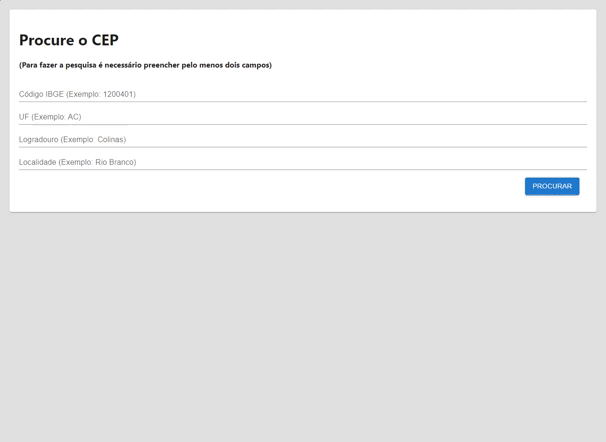

# API procurar CEP

<!-- TABLE OF CONTENTS -->

## Índice
* [Sobre o projeto](#sobre-o-projeto)
  * [Construído com](#construído-com)
* [Execute no seu computador](#execute-no-seu-computador)
* [Como usar](#como-usar)
* [Contato](#contato)

<!-- ABOUT THE PROJECT -->
## Sobre o projeto

criar uma tela que consuma a <a href="https://focusnfe.com.br/doc/#consulta-de-cep-beta_consulta-de-cep-beta">API de CEPs</a>.

### Construído com
* HTML
* CSS
* Git
* GitHub
* npm
* NodeJS
* ReactJS
* TypeScript

## Execute no seu computador

1 - Backend
* Start Backend:
  * cd backend (Entrar na pasta Backend);
  * Run: npm i (Instalar dependências);
  * Run: npm start (Iniciar o Backend).

2 - Frontend
* Start Frontend:
  * cd frontend;
  * Run: npm i (Instalar dependências);
  * Run: npm start (Iniciar o Frontend).

## Como usar

 

 

<!-- Contato -->
## Contato
Felipe Enne Mendes Ribeiro
* Email - felipeenne@gmail.com
* <a href="https://www.linkedin.com/in/felipe-enne/" target="_blank">LinkedIn</a>
* <a href="https://felipeenne.com/" target="_blank">Portfolio</a>